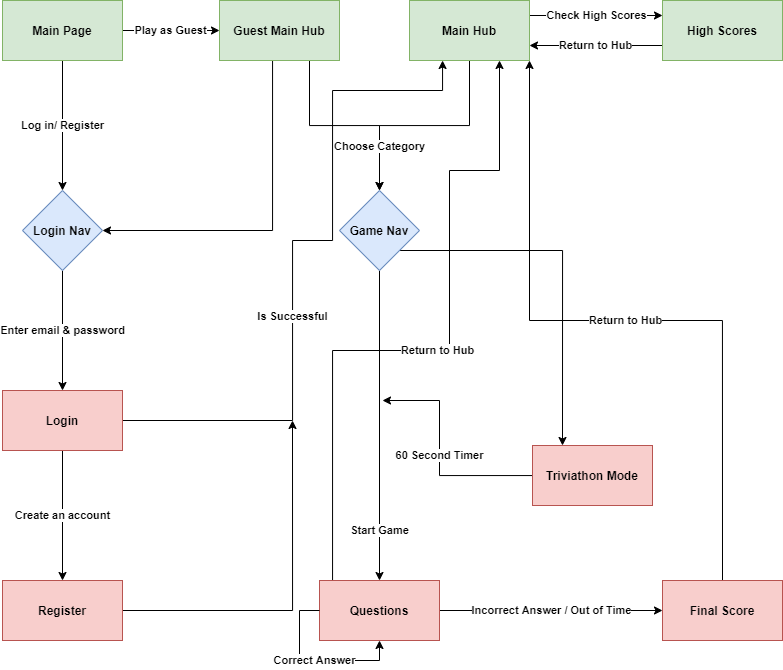
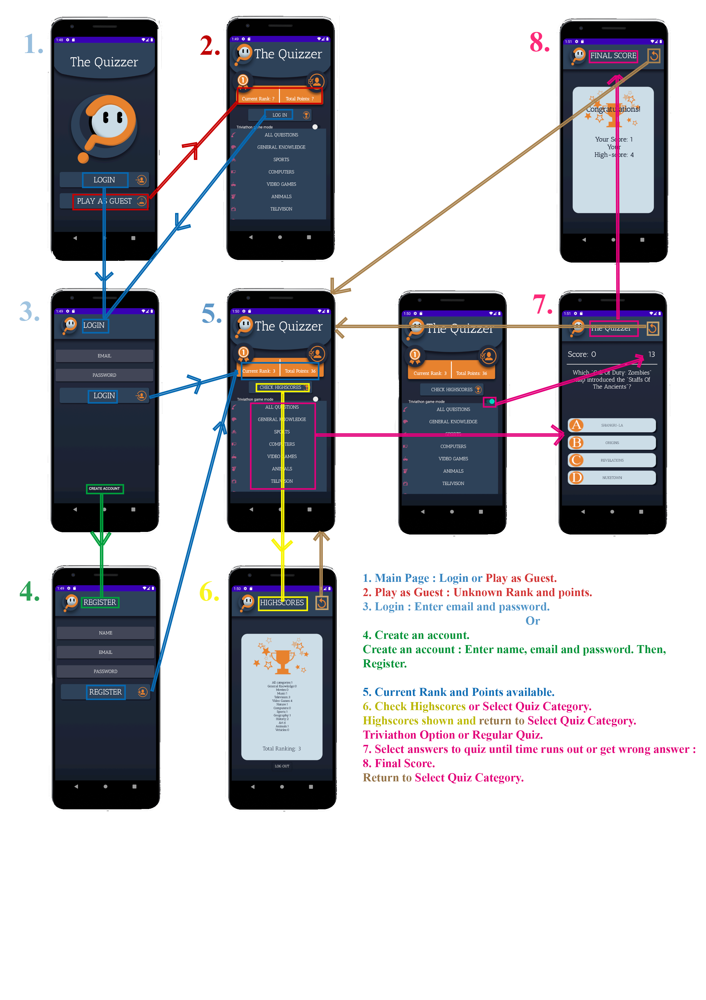

# **Graphical Overview of the Navigation Structure**
*Fig.1 - Overview Diagram*

**Main Page**
Starting the app; the user is brought to the main page where they are given the option to either log in or play as guest.

**Play as Guest**
The user has no access to current rank or total points but may still start a quiz. They are given the option to log in from here also.

**Log In**
By selecting "Login", the user must enter both their email and password. If they do not have an acccount they must create one with "Create an Account".

**Register**
By creating an account they must enter their name, password and email to register with our FireBaseAuth API. Doing this or already ahving an account will direct them to the "Main Hub".

**Main Hub**
From here, the user can select a category from a variety of choices for their quiz or select the triviathon switch for a 60 second mode. This will direct the user to the quiz questions. The user may also view their highscores from the "Check Highscores" button.

**High Scores**
The user may view all the best scores they have received in every category they have played thus far. These scores will continuously be updated everytime the user achieves a new personal best. 

**Questions**
The user is given a selection of 4 choices for their answer to the random question from our TrviaGame API. They will continue to answer questions, increasing their score until they get a question wrong or the timer (in both modes) runs out. The user is then directed to the score screen. They may return to the main hub from here.

**Score**
Upon completion of a quiz, the user may view their score and current high score of the selected category. They may return to the main hub from here. 

*Fig.2 - Visual Android App Diagram*

